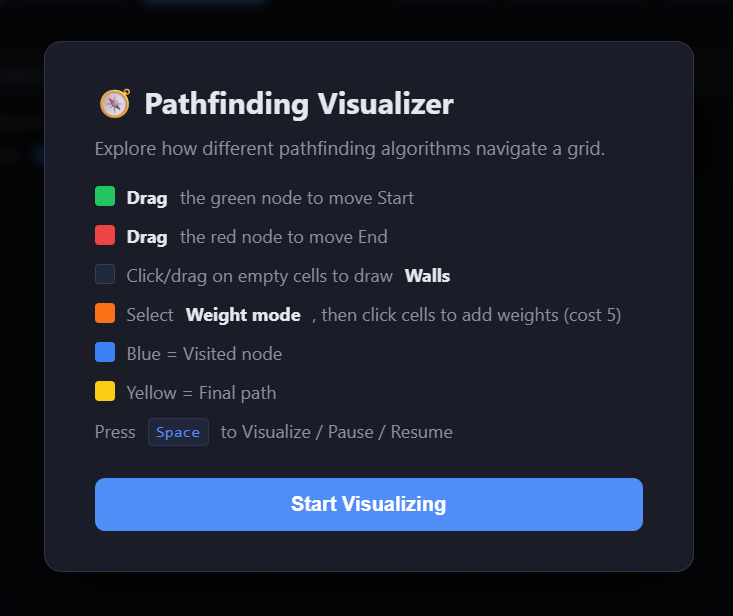
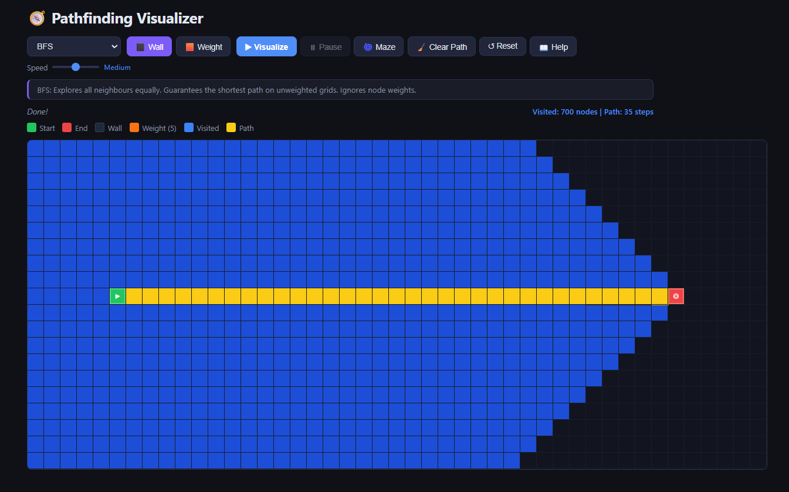
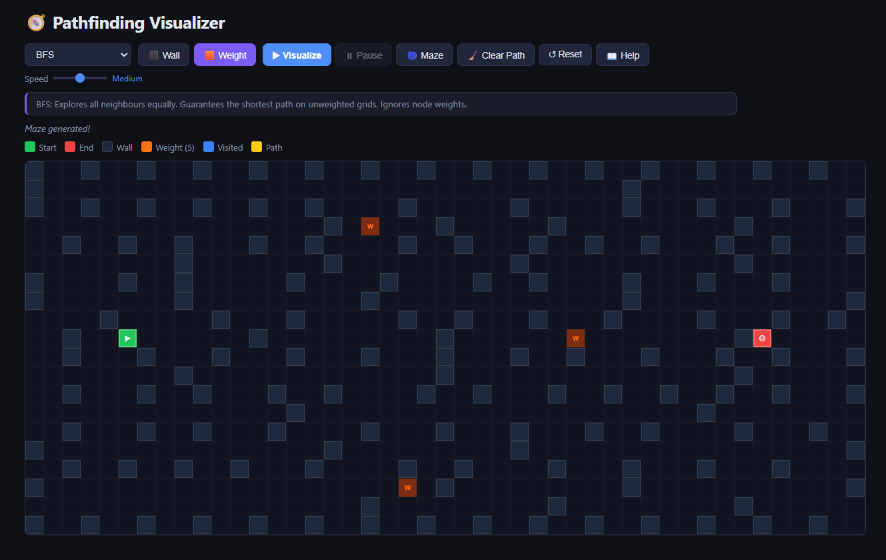

# 🧭 Pathfinding Visualizer

An interactive **Pathfinding Visualizer** built with **HTML, CSS, and JavaScript** that demonstrates how different graph traversal and shortest-path algorithms explore a grid.

<p align="center">
  
</p>

<p align="center">
  <a href="https://ajunabia228.github.io/pathfinding-visualizer/">
    
  </a>
</p>

Users can:
- 🟩 Drag the start node anywhere on the grid
- 🟥 Drag the end node anywhere on the grid
- ⬛ Draw walls by clicking or dragging
- 🟧 Place weighted nodes that cost more to traverse
- 🌀 Generate a maze automatically
- ▶️ Visualize algorithms step-by-step
- ⏸️ Pause and resume animations
- 🎚️ Control animation speed
- 📊 View visited node count and path length after each run
- 📖 Read instructions from the start menu

---

## ✨ Features

- 🗺️ Interactive grid-based board
- ⬛ Click and drag to draw walls
- 🟧 Weight mode — place nodes with a traversal cost of 5
- 🟩 Draggable start node
- 🟥 Draggable end node
- 🌀 Maze generation via Recursive Division
- 🎞️ Ripple animations for visited nodes and final path
- ⏸️ Pause / Resume support
- 🎚️ Speed control — Slow, Medium, Fast
- 📋 Algorithm description panel that updates per selection
- 📊 Post-run stats: visited node count and path length
- 🚫 No-path detection message
- 📖 Start menu with instructions
- ⌨️ Keyboard shortcut: `Space` to visualize, pause, or resume
- 📱 Mobile touch support

<p align="center">
  
</p>

---

## 🧠 Algorithms Included

- **BFS (Breadth-First Search)**
  Finds the shortest path in an unweighted grid. Ignores node weights.

- **DFS (Depth-First Search)**
  Explores deeply before backtracking. Does **not** guarantee the shortest path.

- **Dijkstra's Algorithm**
  Finds the shortest path in weighted graphs. Respects node weights — will route around heavy nodes.

- **Greedy Best-First Search**
  Races toward the target using a heuristic. Fast, but **not** guaranteed to find the shortest path.

- **A\* Search**
  Combines actual path cost and heuristic distance. Weighted-aware and guarantees the shortest path. Generally the best choice.

> 💡 **Tip:** Place some weighted nodes and compare how BFS (ignores weights) vs Dijkstra/A\* (respects weights) differ in the paths they find.

---

## 🛠️ Built With

<p align="center">
  <a href="https://developer.mozilla.org/en-US/docs/Web/HTML">
    
  </a>
  <a href="https://developer.mozilla.org/en-US/docs/Web/CSS">
    
  </a>
  <a href="https://developer.mozilla.org/en-US/docs/Web/JavaScript">
    
  </a>

---

## 📁 Project Structure

```bash
pathfinding-visualizer/
├── index.html
├── style.css
├── script.js
├── screenshots/
│   ├── instructions.png
│   ├── maze.png
│   ├── visualize.png
├── algorithms/
│   ├── bfs.js
│   ├── dfs.js
│   ├── dijkstra.js
│   ├── greedy.js
│   └── astar.js
└── utils/
    └── grid.js
```

---

## 🚀 How to Run Locally

**Option 1: Open directly in browser**

Just open `index.html` in your browser.

**Option 2: Use VS Code Live Server**

If you want a smoother local experience:

1. Open the project in VS Code
2. Install the [Live Server](https://marketplace.visualstudio.com/items?itemName=ritwickdey.LiveServer) extension
3. Right-click `index.html`
4. Click **Open with Live Server**

---

## 🎮 How to Use

1. Open the app and read the instructions in the start menu
2. Click **Start Visualizing**
3. **Drag** the 🟩 green or 🟥 red node to reposition start and end
4. Click or drag on empty cells to draw **walls**
5. Switch to **Weight mode** and click cells to place weighted nodes (cost 5)
6. Click **🌀 Maze** to auto-generate a maze
7. Choose an algorithm from the dropdown
8. Adjust the **Speed** slider (Slow / Medium / Fast)
9. Click **▶ Visualize** or press `Space`
10. Use **⏸ Pause** to pause mid-animation and **▶ Resume** to continue
11. Use **🧹 Clear Path** to remove visited/path colours while keeping walls
12. Use **↺ Reset** to restore the full board

<p align="center">
  
</p>

---

## 🎨 Color Legend

| Color | Meaning |
|-------|---------|
| 🟩 Green | Start node |
| 🟥 Red | End node |
| ⬛ Black | Wall |
| 🟧 Orange | Weighted node (cost 5) |
| 🟦 Blue | Visited node |
| 🟨 Yellow | Final path |

---

## 📌 Notes on Algorithm Behavior

- **BFS** and **Dijkstra** will look similar on an unweighted board (add weight nodes to see them diverge)
- **DFS** does not guarantee the shortest path
- **Greedy Best-First** can be fast but may miss the optimal route
- **A\*** is the most efficient at finding the true shortest path on weighted grids
- Weighted nodes only affect **Dijkstra** and **A\*** (BFS and DFS ignore them entirely)

---

## ⌨️ Keyboard Shortcut

| Key | Action |
|-----|--------|
| `Space` | Visualize / Pause / Resume |

---

## 🙌 Acknowledgments

Built as a learning project to better understand:

- Graph traversal and shortest-path algorithms
- Weighted graphs and heuristic search
- Maze generation (Recursive Division)
- Animation logic and DOM manipulation
- Drag-and-drop interactions
- Touch and mobile support
